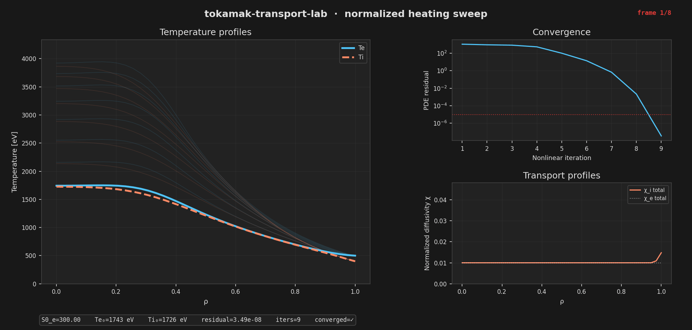
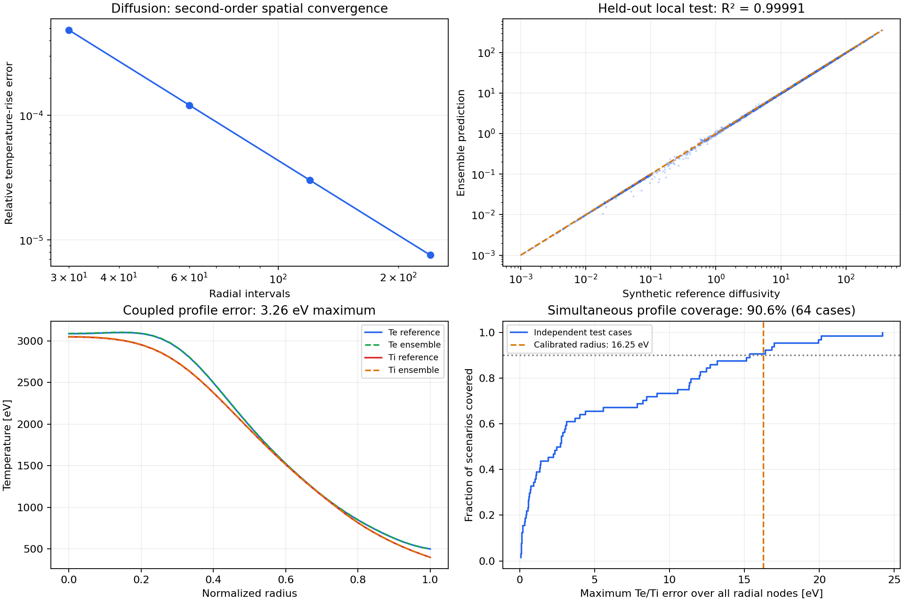

<h1 align="center">Tokamak Transport Lab</h1>

<p align="center">
  <strong>Radial heat transport · Neural closures · Quantified uncertainty</strong><br>
  A computational lab at the intersection of plasma modelling and machine learning.
</p>

<p align="center">
  <a href="https://github.com/davidgisbertortiz-arch/tokamak-transport-lab/actions/workflows/ci.yml"></a>
  <a href="pyproject.toml"></a>
  <a href="docs/ml-and-uncertainty.md"></a>
  <a href="LICENSE"></a>
</p>

<p align="center">
  <a href="#overview">Overview</a> ·
  <a href="#results">Results</a> ·
  <a href="#quickstart">Quickstart</a> ·
  <a href="#the-model">The model</a> ·
  <a href="#documentation">Documentation</a>
</p>



<p align="center">
  <em>Eight converged stationary solutions as electron heating increases from 300 to 1000 eV per normalized time.</em><br>
  <a href="assets/demo.json">Explore the configuration and diagnostics behind each frame →</a>
</p>

## Overview

Tokamak Transport Lab explores how heating, boundary conditions and transport
closures shape electron and ion temperature profiles in a simplified tokamak
model. It connects a conservative radial solver, PyTorch surrogates and
uncertainty calibration in a reproducible workflow, with a Streamlit interface
for running experiments.

The central experiment is to **replace an analytic diffusivity closure with a
trained neural network inside the nonlinear solver**, then measure the effect
on the resulting temperature profiles. Validation follows the calculation from
the numerical operator to local ML predictions and complete coupled solutions.

| Physics & numerics | Machine learning | Uncertainty & reproducibility |
|---|---|---|
| Coupled electron–ion heat transport in 1D circular geometry | Single MLP and three-member neural ensemble | Separate calibration and test datasets |
| Conservative radial diffusion and Crank–Nicolson transients | Five closure inputs; direct log-diffusivity learning | Local diffusivity and simultaneous temperature intervals |
| Stationary Picard/Newton iteration with PDE residual checks | Versioned models with transforms, bounds and feature schema | Reproducible scripts, model hashes and numerical benchmarks |

**Scope.** This is a synthetic transport testbed with normalized radius, time and
diffusivity; temperatures are expressed in eV. The closure is a prescribed
critical-gradient law. Experimental plasma validation, gyrokinetics and
device-specific predictions are outside the current model.

## Results

The recorded run combines numerical verification with independent synthetic
test data. The figure and metrics below are generated by the repository's scripts.



| Experiment | Recorded result | Evaluation scope |
|---|---|---|
| Spatial convergence | **2.00 observed order** | Four grids, compared with independent quadrature |
| Ensemble diffusivity prediction | **R² = 0.99991** · **0.44% median relative error** | 3,000 independent synthetic test samples |
| Coupled temperature profiles | **3.26 eV maximum discrepancy** | Both channels in the documented reference case |
| Local diffusivity intervals | **89.43% empirical coverage** | 3,000 independent test samples; nominal 90% |
| Simultaneous temperature intervals | **58/64 scenarios covered — 90.625%** | Independent test scenarios; nominal 90% |

All three supplied heating scenarios converge without temperature clipping.
Additional checks verify source-to-boundary energy balance and stationary
initial-condition independence.

The temperature intervals measure surrogate error relative to the analytic
**discrete model**, simultaneously across both channels and all 40 radial nodes.
Coverage is marginal over the specified synthetic source/pedestal distribution.
The 64-case test is a finite empirical evaluation; it does not establish coverage
for arbitrary slider settings, discretization error or real plasma physics.

[Full metrics and provenance](docs/validation/summary.json) ·
[Calibration protocol and assumptions](docs/ml-and-uncertainty.md#profile-experiment)

## Quickstart

Use **Python 3.11 or 3.12**. From a terminal on Linux or macOS:

```bash
git clone https://github.com/davidgisbertortiz-arch/tokamak-transport-lab.git
cd tokamak-transport-lab

python3.11 -m venv .venv
source .venv/bin/activate
python -m pip install -e '.[dev,demo,gif]'

python -m streamlit run src/tokamak_transport_lab/app/demo.py
```

Open **[localhost:8501](http://localhost:8501)** and start with the **analytic**
model. This mode works immediately, using the prescribed closure.

In the app you can:

- Explore heating presets and adjust source, pedestal and exchange parameters.
- Compare electron and ion profiles, diffusivities and convergence diagnostics.
- Run source sweeps and export results, configuration and metrics as NPZ or JSON.
- Switch to trained MLP or ensemble closures after reproducing the ML workflow.
- Inspect ensemble profile ranges and, within **Profile benchmark**, calibrated
  temperature intervals for the matching model.

For a first numerical experiment from the command line:

```bash
python -m scripts.run_solver_verification
python -m scripts.run_scenarios
```

### Reproduce the ML results

With the virtual environment above active, install the CPU build of PyTorch and
run the complete pipeline. A GPU is not required.

```bash
python -m pip install 'torch>=2.1,<2.6' --index-url https://download.pytorch.org/whl/cpu
python -m scripts.reproduce --gif
```

This command generates data, trains the MLP and ensemble, runs the numerical
benchmarks, calibrates and tests both interval methods, and renders the figures.
It stops if a calculation fails. Use `--skip-training` to reuse existing data
and trained models.

| Generated artifact | Location |
|---|---|
| Training, validation, calibration and test datasets | `data/transport_*.npz` |
| Trained MLP / ensemble | `outputs/surrogate/model.pt` / `outputs/ensemble/model.pt` |
| Profile calibration | `outputs/profile_uq/calibration.json` |
| Validation report and figure | `outputs/validation/summary.json` / `outputs/validation/validation.png` |
| Heating animation | `outputs/reproduction/demo.gif` |

Datasets and weights are generated locally and excluded from Git. Compact
[validation evidence](docs/validation/) is included in the repository.

<details>
<summary><strong>Install the exact tested Linux environment</strong></summary>

For the recorded Linux/CPython 3.11 dependency versions, use the pinned file in a
fresh virtual environment, then install the local package:

```bash
python -m pip install -r requirements-linux-cpu.txt
python -m pip install --no-deps -e .
```

</details>

## The model

With normalized radius $\rho = r/a$ and time $t_\star$, the two channels satisfy:

$$
\frac{\partial T_{e,i}}{\partial t_\star}
= \frac{1}{\rho}\frac{\partial}{\partial\rho}
\left(\rho\chi_{e,i}\frac{\partial T_{e,i}}{\partial\rho}\right)
+ S_{e,i} \mp \nu(T_e-T_i).
$$

The exchange term transfers heat between electrons and ions and cancels in the
total balance. Axis symmetry and fixed outer pedestal temperatures provide
the boundary conditions.

The analytic transport closure activates above a prescribed gradient threshold:

$$
g = \max\!\left(-\frac{1}{T}\frac{\partial T}{\partial\rho},\,0\right),
\qquad
\chi = \chi_{\mathrm{floor}} + \chi_s\,[\max(g-g_{\mathrm{crit}},\,0)]^\alpha.
$$

Here $\chi$ is **normalized diffusivity** and `S0_e` is a peak heating rate in
eV per normalized time. No device power in MW is inferred.

<details>
<summary><strong>Numerical methods and learned closures</strong></summary>

- **Conservative discretization:** shared face fluxes enforce radial energy
  balance. Electron–ion exchange is solved in the coupled matrix.
- **Distinct transient and stationary solves:** Crank–Nicolson advances time;
  elliptic Picard updates, Newton iteration and a hybrid rescue method solve
  stationary balance. Convergence uses the source-scaled PDE residual.
- **Synthetic training:** 20,000 Latin-hypercube samples and three separate
  3,000-sample IID splits for validation, calibration and testing.
- **Neural closure:** three 64-unit SiLU layers learn standardized log diffusivity
  from five active inputs. Inference preserves the prescribed subcritical floor
  and continuity at the threshold. The ensemble averages member diffusivities.
- **Full-profile uncertainty:** each ensemble member can be propagated through
  a complete solve. Member ranges describe disagreement; a separate split
  conformal experiment calibrates simultaneous temperature intervals.
- **Traceable inference:** model bundles store weights, transforms, bounds and
  feature order. App and CLI share model dispatch and record artifact hashes
  and the fraction of inputs outside training bounds.

The analytic law is inexpensive; the neural closure demonstrates solver
integration and error propagation rather than a computational speedup.

See [physics and numerical conventions](docs/physics.md) and
[ML architecture and uncertainty methods](docs/ml-and-uncertainty.md).

</details>

<details>
<summary><strong>Run individual experiments or select a trained model</strong></summary>

Run these commands from the repository root with the virtual environment active.
Training and uncertainty commands require PyTorch. Run data generation before
training, and training before calibration.

| Command | Experiment |
|---|---|
| `python -m scripts.run_solver --config configs/solver.yaml` | Finite transient with a separate stationary residual |
| `python -m scripts.run_picard --config configs/picard.yaml --run-id single` | Single-channel stationary profile |
| `python -m scripts.run_picard --config configs/scenarios/mid_power.yaml --run-id coupled` | Coupled electron–ion stationary profiles |
| `python -m scripts.generate_dataset` | Four independent data splits |
| `python -m scripts.train_surrogate` | Single MLP training |
| `python -m scripts.train_ensemble` | Three-member ensemble training |
| `python -m scripts.calibrate_conformal` | Local diffusivity calibration and test evaluation |
| `python -m scripts.calibrate_profiles` | Simultaneous profile calibration and test evaluation |
| `python -m scripts.validate_project` | Numerical and ML report after the pipeline has run |
| `python -m scripts.make_readme_gif` | Converged heating sweep with per-frame provenance |

To use a trained closure, add the following to a stationary YAML configuration
and pass it to `scripts.run_picard`:

```yaml
model:
  type: ensemble  # analytic, mlp, or ensemble
  path: outputs/ensemble/model.pt
```

Start from the supplied [scenario configurations](configs/scenarios/).
The app and CLI report missing artifacts or nonconvergence explicitly.

</details>

## Engineering and verification

The recorded local validation passed **202 tests** on Python 3.11.12, together
with Ruff lint, formatting and dependency checks. The GitHub Actions workflow
is configured for Python 3.11 and 3.12 and also runs numerical verification
and the supplied YAML scenarios.

```bash
python -m pytest
ruff check src/ tests/ scripts/
ruff format --check src/ tests/ scripts/
```

Tests cover analytic and manufactured solutions, spatial and temporal order,
energy conservation, false convergence, model persistence and dispatch,
conformal order statistics, and Streamlit interaction and error handling.
The full suite uses the PyTorch installation from the ML setup above.

```text
src/tokamak_transport_lab/
├── solver/       # Radial operators and transient integration
├── integration/  # Stationary solves and shared configuration dispatch
├── transport/    # Analytic closures and trained-model adapters
├── data/         # Synthetic sampling and dataset generation
├── surrogate/    # Neural training, inference and uncertainty
└── app/          # Interactive Streamlit experiments

scripts/          # Reproducible experiment entry points
configs/          # Solver, training and scenario settings
tests/            # Numerical, ML and application verification
docs/             # Methods, assumptions and recorded evidence
```

## Documentation

| Reference | Contents |
|---|---|
| [Physics and numerics](docs/physics.md) | Equations, normalization, discretization, boundary conditions and model limits |
| [Machine learning and uncertainty](docs/ml-and-uncertainty.md) | Data design, network architecture, inference rules and coverage assumptions |
| [Validation results](docs/validation/summary.json) | Full benchmark values, experiment parameters and source/model hashes |
| [Validation notes](docs/validation-notes.md) | Numerical design decisions, regression evidence and verification record |
| [Experiment configurations](configs/) | Reusable YAML settings for simulations and training |

## License

Released under the [MIT License](LICENSE).
